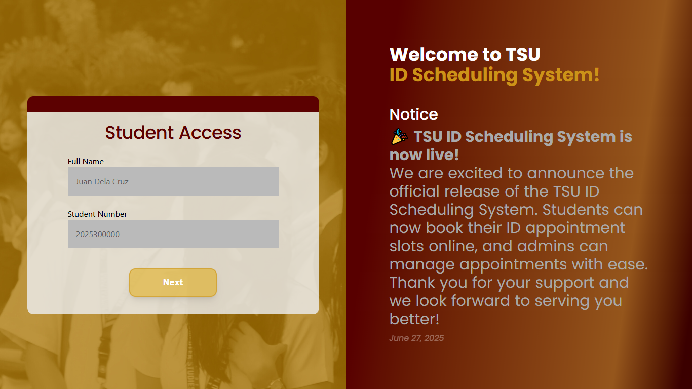

# 🎓 TSU ID Scheduling System


[](LICENSE)
[](#)

A full-stack web application for **Tarlac State University - Office of Business Affairs and Auxiluary Sevices** to streamline student ID appointment scheduling, management, and administration. Built for reliability, ease of use, and scalability.

---

## 🚀 Table of Contents
- [Features](#features)
- [Tech Stack](#tech-stack)
- [Screenshots](#screenshots)
- [Getting Started](#getting-started)
  - [Backend Setup](#backend-setup)
  - [Frontend Setup](#frontend-setup)
- [Project Structure](#project-structure)
- [API Overview](#api-overview)
- [Usage](#usage)
- [Troubleshooting & FAQ](#troubleshooting--faq)
- [Documentation](#documentation)
- [Contributing](#contributing)
- [License](#license)
- [Contact](#contact)

---

## ✨ Features

### Student Portal
- 📝 Student registration with validation
- 📅 Interactive calendar for appointment selection
- ⏱️ Real-time slot availability and feedback
- 📲 Mobile-friendly, responsive design
- 📧 Email confirmation (optional, if configured)

### Admin Portal
- 👨‍💼 Secure admin authentication
- 📊 Dashboard for monitoring appointments and statistics
- 🗂️ Student and schedule management (add/edit/delete)
- 🗃️ Export data to Excel/CSV
- 🔄 Adjust slot limits and manage system settings

### System
- 🔒 Secure authentication and data handling
- 🛠️ Robust error handling and user-friendly messages
- 🧪 Automated tests for backend and frontend

---

## 🛠️ Tech Stack

**Frontend:**
- React.js (Vite)
- Tailwind CSS
- Axios (API requests)
- Date-fns (date utilities)
- Jest & React Testing Library (testing)

**Backend:**
- PHP (7.4+)
- MySQL/MariaDB
- PDO (secure DB access)
- RESTful API design

**Development Tools:**
- Node.js (16+)
- ESLint, Prettier
- XAMPP/WAMP/MAMP for local PHP/MySQL

---

## 📸 Screenshots

| Student View | Admin View |
|--------------|------------|
|  |  |

---

## 🏁 Getting Started

### Backend Setup
1. **Install PHP & MySQL** (e.g., XAMPP, WAMP, MAMP)
2. **Clone the repository:**
   ```bash
   git clone https://github.com/yourusername/tsu-id-schedule.git
   cd tsu-id-schedule/backend
   ```
3. **Configure Database:**
   - Import `backend/database/schema.sql` into your MySQL server.
   - Edit `backend/config.php` with your DB credentials.
4. **Environment Variables:**
   - Copy `.env.example` to `.env` and set values as needed (if used).
5. **Start PHP Server:**
   - Use XAMPP/WAMP/MAMP or run:
     ```bash
     php -S localhost:8000
     ```

### Frontend Setup
1. **Install Node.js (16+)**
2. **Install dependencies:**
   ```bash
   cd ../frontend
   npm install
   ```
3. **Configure Environment:**
   - Run:
     ```bash
     npm run setup
     ```
   - Or create `.env` with:
     ```env
     VITE_API_BASE_URL=http://localhost/Projects/TSU-ID-Scheduling-System/backend
     ```
4. **Start Development Server:**
   ```bash
   npm run dev
   ```
   - Visit [http://localhost:3000](http://localhost:3000)

---

## 🗂️ Project Structure

```
TSU-ID-Scheduling-System/
├── backend/           # PHP backend (API, DB, logic)
│   ├── config.php     # DB config
│   ├── database/      # SQL schema & migrations
│   ├── tests/         # Backend test scripts
│   └── ...            # API endpoints, utils
├── frontend/          # React frontend
│   ├── src/           # Source code
│   │   ├── Components/  # UI components
│   │   ├── config/      # API config
│   │   └── ...
│   ├── public/        # Static assets
│   └── ...
├── README.md          # Project documentation
└── ...
```

---

## 📡 API Overview

- All backend endpoints are in `/backend/` (see `backend/` PHP files)
- Example endpoints:
  - `POST /backend/register.php` — Register student
  - `POST /backend/login.php` — Login (student/admin)
  - `GET /backend/get_slot_count.php` — Get slot availability
  - `POST /backend/booking.php` — Book appointment
  - `POST /backend/adjustLimitofSlots.php` — Admin slot adjustment
- See `frontend/src/config/api.js` for how the frontend interacts with the API.
- For more, see [frontend/docs/DEPLOYMENT_GUIDE.md](frontend/docs/DEPLOYMENT_GUIDE.md) and code comments.

---

## 📝 Usage

### For Students
1. Register or log in
2. Select an available slot
3. Confirm your appointment
4. (Optional) Download/print/screenshot your schedule

### For Admins
1. Log in to the admin portal
2. View and manage student appointments
3. Adjust slot limits, export data, and monitor system

---

## 🛠️ Troubleshooting & FAQ

- **Cannot connect to backend?**
  - Check your `.env` and API base URL
  - Ensure PHP server is running
  - Verify CORS settings in backend
- **CORS errors?**
  - Make sure frontend and backend are on the same domain/port in production
- **Database errors?**
  - Confirm DB credentials and schema import
- **Environment variables not loading?**
  - Restart dev server after changes
- **More help?**
  - See [frontend/docs/DEPLOYMENT_GUIDE.md](frontend/docs/DEPLOYMENT_GUIDE.md) and [frontend/docs/CONTRIBUTING.md](frontend/docs/CONTRIBUTING.md)

---

## 📚 Documentation
- [Deployment Guide](frontend/docs/DEPLOYMENT_GUIDE.md)
- [Contributing](frontend/docs/CONTRIBUTING.md)
- [Data Consistency Fixes](frontend/docs/DATA_CONSISTENCY_FIXES.md)
- [Guidelines](frontend/docs/GUIDELINES.md)

---

## 🤝 Contributing

1. Fork the repository
2. Create a feature branch (`git checkout -b feature/YourFeature`)
3. Commit your changes (`git commit -m 'Add feature'`)
4. Push to your branch (`git push origin feature/YourFeature`)
5. Open a Pull Request

---

## 📄 License

MIT License — see [LICENSE](LICENSE) for details.

---

## 📬 Contact

Maintainer: [MUMEi-28]
Project Link: [https://github.com/MUMEi-28/TSU-ID-Scheduling-System](https://github.com/MUMEi-28/TSU-ID-Scheduling-System)
